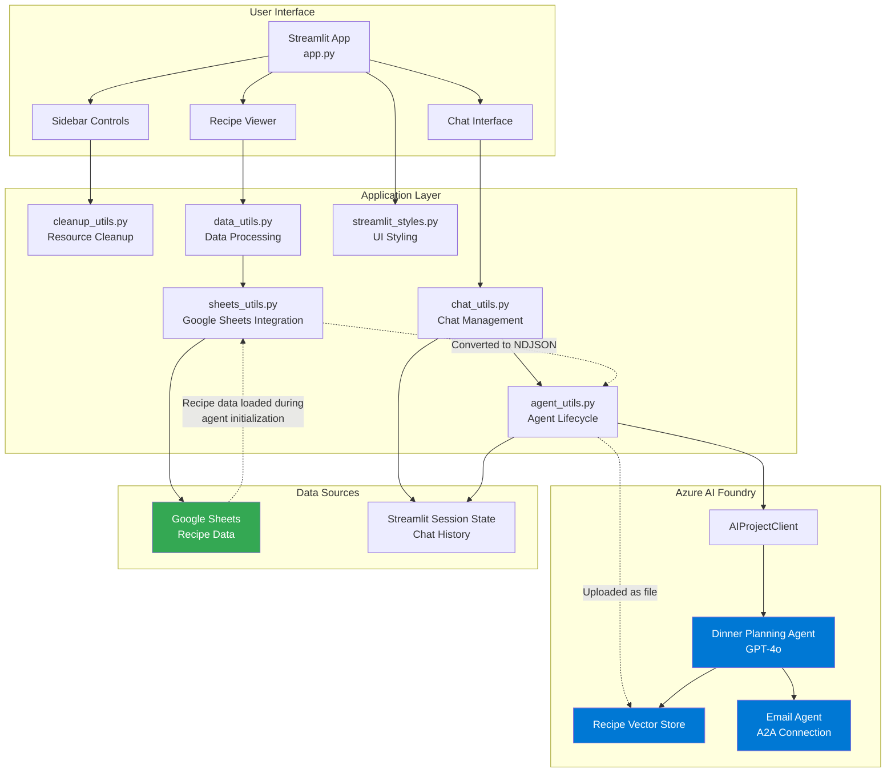
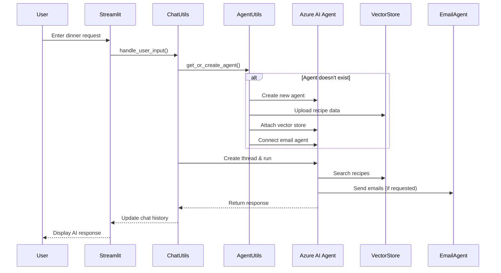
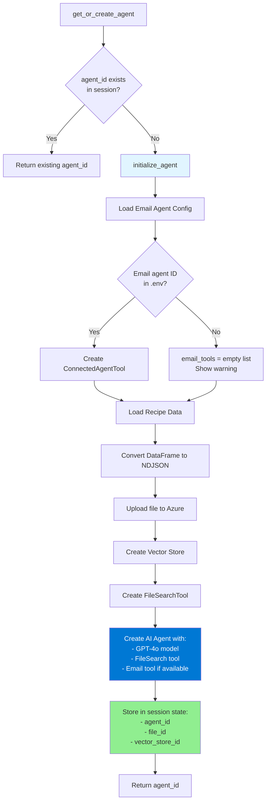
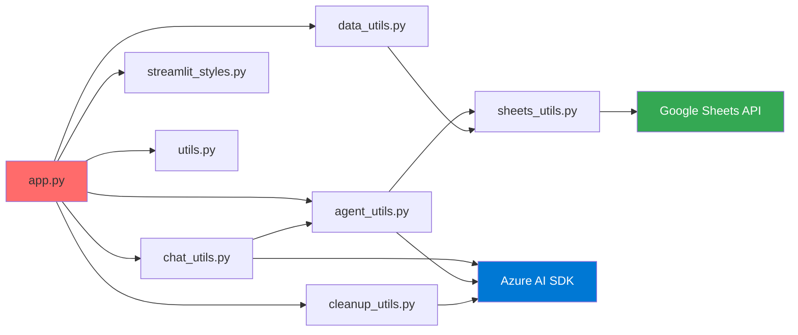

## Architecture

### System Architecture

```mermaid
graph TD
    subgraph "User Interface"
        Chat[Chat Interface]
        Controls[Sidebar Controls]
        Recipes[Recipe Viewer]
        UI[Streamlit App<br/>app.py]
    end
    
    subgraph "Application Layer"
        ChatUtils[chat_utils.py<br/>Chat Management]
        CleanupUtils[cleanup_utils.py<br/>Resource Cleanup]
        DataUtils[data_utils.py<br/>Data Processing]
        Styles[streamlit_styles.py<br/>UI Styling]
        AgentUtils[agent_utils.py<br/>Agent Lifecycle]
        SheetsUtils[sheets_utils.py<br/>Google Sheets Integration]
    end
    
    subgraph "Azure AI Foundry"
        ProjectClient[AIProjectClient]
        Agent[Dinner Planning Agent<br/>GPT-4o]
        VectorStore[Recipe Vector Store]
        EmailAgent[Email Agent<br/>A2A Connection]
    end
    
    subgraph "Data Sources"
        GoogleSheets[Google Sheets<br/>Recipe Data]
        SessionState[Streamlit Session State<br/>Chat History]
    end
    
    UI --> Chat
    UI --> Recipes
    UI --> Controls
    UI --> Styles
    
    Chat --> ChatUtils
    Controls --> CleanupUtils
    Recipes --> DataUtils
    
    ChatUtils --> AgentUtils
    AgentUtils --> ProjectClient
    DataUtils --> SheetsUtils
    
    SheetsUtils --> GoogleSheets
    GoogleSheets -.->|Recipe data loaded during<br/>agent initialization| SheetsUtils
    SheetsUtils -.->|Converted to NDJSON| AgentUtils
    AgentUtils -.->|Uploaded as file| VectorStore
    
    ProjectClient --> Agent
    Agent --> VectorStore
    Agent --> EmailAgent
    
    ChatUtils --> SessionState
    AgentUtils --> SessionState
    
    style Agent fill:#0078d4,color:#fff
    style VectorStore fill:#0078d4,color:#fff
    style EmailAgent fill:#0078d4,color:#fff
    style GoogleSheets fill:#34a853,color:#fff
```

### Data Flow - User Interaction

```mermaid
sequenceDiagram
    participant User
    participant Streamlit
    participant ChatUtils
    participant AgentUtils
    participant Azure as Azure AI Agent
    participant VectorStore
    participant EmailAgent
    
    User->>Streamlit: Enter dinner request
    Streamlit->>ChatUtils: handle_user_input()
    ChatUtils->>AgentUtils: get_or_create_agent()
    
    alt Agent doesn't exist
        AgentUtils->>Azure: Create new agent
        AgentUtils->>VectorStore: Upload recipe data
        AgentUtils->>Azure: Attach vector store
        AgentUtils->>Azure: Connect email agent
    end
    
    ChatUtils->>Azure: Create thread & run
    Azure->>VectorStore: Search recipes
    Azure->>EmailAgent: Send emails (if requested)
    Azure-->>ChatUtils: Return response
    ChatUtils-->>Streamlit: Update chat history
    Streamlit-->>User: Display AI response
```

### Agent Initialization Flow

```mermaid
flowchart TD
    A[get_or_create_agent] --> B{agent_id exists<br/>in session?}
    B -->|Yes| C[Return existing agent_id]
    B -->|No| D[initialize_agent]
    
    D --> E[Load Email Agent Config]
    E --> F{Email agent ID<br/>in .env?}
    F -->|Yes| G[Create ConnectedAgentTool]
    F -->|No| H[email_tools = empty list<br/>Show warning]
    
    G --> I[Load Recipe Data]
    H --> I
    
    I --> J[Convert DataFrame to NDJSON]
    J --> K[Upload file to Azure]
    K --> L[Create Vector Store]
    L --> M[Create FileSearchTool]
    
    M --> N[Create AI Agent with:<br/>- GPT-4o model<br/>- FileSearch tool<br/>- Email tool if available]
    
    N --> O[Store in session state:<br/>- agent_id<br/>- file_id<br/>- vector_store_id]
    
    O --> P[Return agent_id]
    
    style D fill:#e1f5ff
    style N fill:#0078d4,color:#fff
    style O fill:#90ee90
```

### Component Dependencies

```mermaid
graph LR
    App[app.py] --> ChatUtils[chat_utils.py]
    App --> AgentUtils[agent_utils.py]
    App --> DataUtils[data_utils.py]
    App --> CleanupUtils[cleanup_utils.py]
    App --> Styles[streamlit_styles.py]
    App --> Utils[utils.py]
    
    ChatUtils --> AgentUtils
    AgentUtils --> SheetsUtils[sheets_utils.py]
    DataUtils --> SheetsUtils
    
    ChatUtils --> Azure[Azure AI SDK]
    AgentUtils --> Azure
    CleanupUtils --> Azure
    
    SheetsUtils --> Google[Google Sheets API]
    
    style App fill:#ff6b6b
    style Azure fill:#0078d4,color:#fff
    style Google fill:#34a853,color:#fff
```